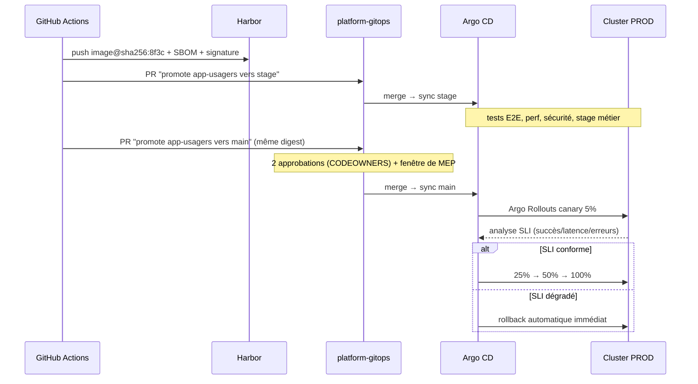

# 01 — Tâche 1 : syfFerdinand et architecture cible de la chaîne CI/CD

## 1. Principes directeurs

| Principe | Traduction concrète |
|---|---|
| **Git est la source de vérité** | Code, infrastructure, configuration, politiques et état désiré des clusters sont versionnés |
| **Artefact immuable promu, jamais reconstruit** | Une image = un digest, promue dev → stage → prod |
| **Tout changement passe par une Pull Request** | Y compris un changement de production ; pas d'action hors Git |
| **Séparation build / deploy** | La CI produit et certifie ; le CD (Argo CD) réconcilie l'état |
| **Sécurité intégrée au plus tôt** | Contrôles dans la PR, pas en fin de cycle |
| **Le retour arrière est un geste ordinaire** | Testé à chaque MEP, mesuré, documenté |
| **Moindre privilège** | La CI ne possède pas d'accès en écriture au cluster de production |

## 2. syfFerdinand des dépôts

```
org/
├── app-<service>/            # 1 dépôt par application : code + Dockerfile + tests + CI
│   └── .github/workflows/ci.yaml
├── platform-gitops/          # état désiré des clusters (Argo CD) — CE DÉPÔT
│   ├── gitops/base/          # socle commun
│   ├── gitops/overlays/      # dev | stage | prod
│   └── gitops/argocd/        # app-of-apps, ApplicationSet, AnalysisTemplate
├── platform-infra/           # Terraform / OpenTofu : cluster, réseau, registry, Vault, DNS
├── platform-policies/        # Kyverno / OPA, règles d'admission mutualisées
└── platform-docs/            # ADR, runbooks, architecture
```

**Pourquoi séparer code applicatif et dépôt GitOps** : la promotion d'environnement devient un commit
identifiable et revu, l'historique de production est lisible, et les droits d'approbation sur la production
sont portés par un dépôt distinct (CODEOWNERS), indépendamment des droits sur le code.

## 3. Vue d'ensemble de la chaîne

```mermaid
flowchart LR
    subgraph DEV["Développement"]
        A[Poste dev<br/>pre-commit] --> B[Pull Request]
    end
    subgraph CI["Intégration continue — GitHub Actions"]
        B --> C[Lint + Tests unitaires]
        C --> D[SAST + SCA + Secret scan]
        D --> E[Build image OCI<br/>multi-arch]
        E --> F[SBOM Syft + Signature Cosign]
        F --> G[Scan image Trivy]
        G --> H[(Registry Harbor<br/>image@sha256)]
    end
    subgraph CD["Livraison continue — GitOps"]
        H --> I{{PR auto sur<br/>platform-gitops}}
        I --> J[Argo CD — DEV<br/>sync auto]
        J --> K[Tests intégration + E2E<br/>+ DAST + k6]
        K --> L{{PR de promotion<br/>RECETTE}}
        L --> M[Argo CD — RECETTE<br/>sync auto]
        M --> N[Stage métier + perf<br/>+ tests de rollback]
        N --> O{{PR de promotion PROD<br/>2 approbations + fenêtre}}
        O --> P[Argo CD — PROD<br/>Argo Rollouts canary]
    end
    subgraph RUN["Exploitation"]
        P --> Q[Analyse auto Prometheus<br/>5% → 25% → 50% → 100%]
        Q -->|SLI dégradé| R[Rollback automatique]
        Q -->|SLI conforme| S[Promotion complète]
        S --> T[Smoke tests + annotation Grafana]
    end
```



## 4. Composants et outillage cible

| Domaine | Outil retenu | Rôle | Alternative |
|---|---|---|---|
| Forge / CI | GitHub Actions (runners auto-hébergés) | Build, tests, contrôles | GitLab CI |
| Registre d'images | Harbor | Stockage, scan, rétention, réplication, signature | Artifactory, GAR |
| Qualité de code | SonarQube | Couverture, dette, quality gate bloquant | Qodana |
| SAST | Semgrep | Analyse statique de sécurité | CodeQL |
| SCA / dépendances | Trivy + Dependabot/Renovate | CVE, licences, mises à jour automatiques | Grype, Snyk |
| Secrets dans le code | Gitleaks (pre-commit + CI) | Détection de fuite | TruffleHog |
| SBOM / signature | Syft + Cosign (keyless OIDC) | Traçabilité de la chaîne d'approvisionnement | in-toto |
| IaC | Terraform/OpenTofu + Checkov | Cluster, réseau, Vault, DNS | Pulumi |
| Configuration k8s | Kustomize | Base + overlays, zéro duplication | Helm (pour le tiers) |
| CD | Argo CD | Réconciliation GitOps, détection de drift | Flux |
| Déploiement progressif | Argo Rollouts | Canary, blue/green, analyse, rollback auto | Flagger |
| Admission / politiques | Kyverno | Signature, digest, Pod Security, ressources | OPA Gatekeeper |
| Secrets | HashiCorp Vault + External Secrets Operator | Coffre, rotation, injection | SOPS + age (dégradé) |
| Métriques | Prometheus + Thanos | SLI, alerting, analyse canary | VictoriaMetrics |
| Logs | Loki | Logs structurés corrélés au `trace_id` | Elastic |
| Traces | OpenTelemetry + Tempo | Traçage distribué | Jaeger |
| Visualisation | Grafana | Dashboards SLO, DORA, annotations MEP | — |
| Alerting / astreinte | Alertmanager + outil d'astreinte | Notification, escalade | PagerDuty, Opsgenie |
| Feature flags | Unleash (auto-hébergé) | Découplage déploiement / activation | Flagsmith |
| Tests E2E / charge / DAST | Playwright, k6, OWASP ZAP | Non-régression fonctionnelle, perf, sécurité | Cypress, Gatling |

## 5. Topologie des environnements

| | **Développement** | **Stage** | **Production** |
|---|---|---|---|
| Cluster | Cluster hors-prod, namespace `dev` | Cluster hors-prod, namespace `stage` | Cluster dédié production |
| Déclenchement | Automatique à chaque merge sur `main` | Automatique après succès des tests dev | PR de promotion + approbation + fenêtre |
| Stratégie | Rolling update | Blue/green | Canary avec analyse |
| Données | Jeu de données synthétique | **Données de production anonymisées** | Données réelles |
| Dimensionnement | Réduit (1 réplique) | **Iso-prod en topologie**, réduit en volume | Nominal, HPA + PDB |
| Accès humain | Développeurs, lecture/écriture | Lecture seule + testeurs | **Lecture seule**, écriture par bris de glace tracé |
| Durée de rétention des images | 14 jours | 90 jours | Illimitée pour les versions déployées |

**Environnements éphémères de prévisualisation** : chaque PR peut déclencher un namespace jetable
(`pr-<numéro>`) déployé par ApplicationSet, détruit à la fermeture de la PR. Il donne aux testeurs et au métier
un retour avant fusion, et réduit la charge sur la stage.

## 6. Modèle de promotion

La promotion ne recompile rien. Elle consiste à modifier une seule ligne dans le dépôt GitOps :

```yaml
# gitops/overlays/prod/kustomization.yaml
images:
  - name: registry.service-public.gouv.tg/app-usagers
    digest: sha256:8f3c...   # ← digest validé en stage, identique bit pour bit
```



## 7. Ce que cette architecture change pour les incidents constatés

| Incident type observé | Mécanisme qui l'aurait évité ou contenu |
|---|---|
| Régression fonctionnelle non détectée | Tests E2E bloquants en stage + canary limitant l'exposition à 5 % |
| Configuration oubliée en production | Overlay versionné + détection de drift Argo CD + contrôle de parité en CI |
| Dépendance vulnérable livrée | SCA + scan d'image bloquants, admission Kyverno refusant une image non signée |
| Rollback long et hésitant | Analyse automatique déclenchant `undo` sans intervention, runbook répété mensuellement |
| Secret expiré au moment de la MEP | Rotation gérée par Vault, injection par ESO, alerte à J-15 avant expiration |
