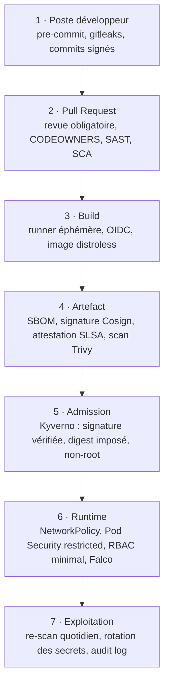
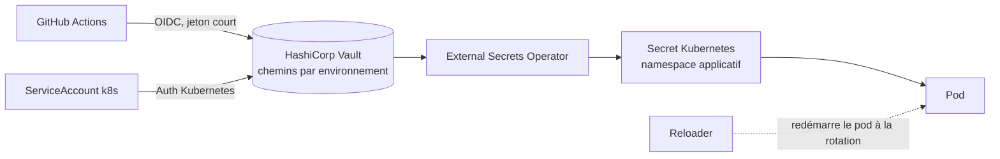

# 04 — Tâche 1 : sécurité de la chaîne et gestion des secrets

Contexte de service public : la plateforme traite des données d'usagers. Les exigences retenues s'alignent sur
le RGPD (minimisation, traçabilité), les recommandations ANSSI (cloisonnement, journalisation, moindre
privilège) et une logique d'homologation de sécurité continue plutôt que ponctuelle.

## 1. Défense en profondeur, du commit au runtime

## 2. Contrôles par étage

### Étage code
- Commits signés (GPG ou Sigstore), historique linéaire, interdiction de `force-push` sur `main`.
- `CODEOWNERS` : le dossier `gitops/overlays/prod` et les politiques exigent l'approbation de l'équipe plateforme et du RSSI.
- Analyse SAST sur le diff pour garder un temps de retour court, analyse complète chaque nuit.

### Étage artefact
- Images de base minimales et épinglées par digest, mises à jour par Renovate avec PR automatique.
- SBOM CycloneDX généré et conservé : permet de répondre en minutes à « sommes-nous exposés à cette CVE ? ».
- Signature keyless Cosign : l'identité du signataire est le workflow GitHub, pas une clé à protéger.
- **Re-scan quotidien des images actuellement déployées** : une CVE publiée après le build est détectée sans attendre la prochaine MEP.

### Étage admission (Kyverno)
Règles bloquantes en production :
1. Image provenant du registre interne **et** référencée par digest (aucun tag mutable, aucun `:latest`).
2. Signature Cosign valide et attestation de provenance présente.
3. `runAsNonRoot`, `readOnlyRootFilesystem`, `allowPrivilegeEscalation: false`, capacités supprimées.
4. `requests`/`limits` CPU et mémoire définis.
5. `livenessProbe` et `readinessProbe` définies.
6. NetworkPolicy par défaut de type « deny all » dans chaque namespace.

Mode `Audit` en dev et recette pendant la période de montée en charge, puis `Enforce` partout.

### Étage runtime
- Pod Security Standard `restricted`, mTLS entre services (maillage ou ingress interne).
- RBAC : les comptes de service n'ont que les droits nécessaires ; aucun `cluster-admin` nominatif permanent.
- Détection comportementale (Falco) sur les événements sensibles : shell dans un conteneur, écriture dans un
  chemin sensible, connexion sortante inattendue.
- Journaux d'audit Kubernetes centralisés et conservés selon la durée légale applicable.

## 3. Gestion des secrets

### Principe
**Aucun secret dans Git, aucun secret dans une image, aucun secret saisi à la main pendant une MEP.**

### Règles de gestion

| Règle | Mise en œuvre |
|---|---|
| Cloisonnement par environnement | Chemins Vault `secret/plateforme/{dev,recette,prod}/…`, politiques distinctes, aucun accès croisé |
| Moindre privilège | Chaque application lit uniquement son propre chemin |
| Aucun secret longue durée dans la CI | Authentification OIDC, jetons de 15 minutes |
| Rotation | Automatique : identifiants de base de données dynamiques (moteur database de Vault), certificats par cert-manager, secrets applicatifs tous les 90 jours |
| Détection de fuite | Gitleaks en pre-commit et en CI, historique scanné à l'initialisation |
| Procédure en cas de fuite | Révocation immédiate, rotation, analyse d'impact via les logs d'accès Vault, déclaration d'incident |
| Traçabilité | Journal d'audit Vault : qui a lu quel secret, quand |
| Solution dégradée | Si Vault indisponible au démarrage du programme : SOPS + age, clés dans un HSM/KMS, migration vers Vault planifiée |

### Ce qui disparaît
Les variables d'environnement copiées dans une interface de CI, les fichiers `.env` échangés par messagerie,
les secrets écrits dans les manifestes et les mots de passe de base connus de plusieurs personnes. Ces pratiques
sont précisément celles qui rendent une MEP manuelle et non reproductible.

## 4. Gestion des vulnérabilités : délais de correction

| Sévérité | Délai de correction | Traitement |
|---|---|---|
| `CRITICAL` exploitable | 48 h | MEP exceptionnelle hors cadence, procédure accélérée à 1 approbation |
| `HIGH` | 7 jours | Intégré à la MEP hebdomadaire |
| `MEDIUM` | 30 jours | Planifié dans le backlog technique |
| `LOW` | Au fil des mises à jour | Renovate |

Un tableau de bord suit l'âge des vulnérabilités ouvertes. L'indicateur suivi est l'âge médian, pas le nombre brut.

## 5. Séparation des tâches et traçabilité des MEP

Exigence classique d'audit pour une plateforme publique : la personne qui développe ne doit pas être la seule
à décider d'une mise en production.

- L'approbation de la PR de promotion en production est assurée par deux personnes, dont une n'ayant pas écrit le code.
- Chaque MEP est identifiable : commit, auteur, approbateurs, digest, horodatage, résultat de l'analyse canary.
- Le dépôt GitOps constitue de fait le registre des changements ; il alimente automatiquement le suivi des
  changements sans ressaisie.
