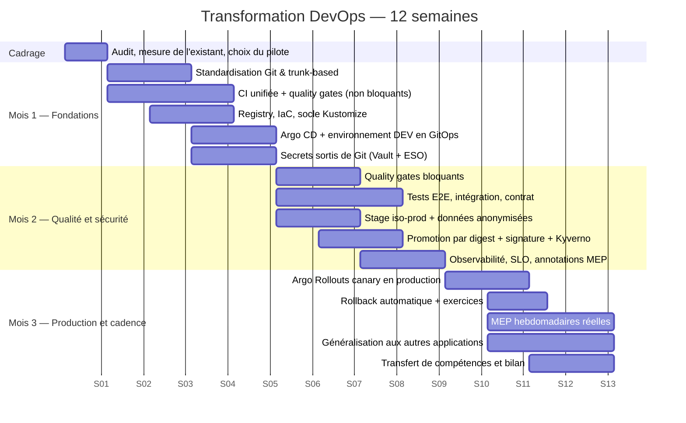

# 07 — Tâche 2 : plan de transformation DevOps sur trois mois

## 1. Cadre et méthode

**Contrainte majeure** : la plateforme est en service. La transformation se fait **sans arrêt de production et
sans geler les livraisons métier**. On ne reconstruit pas, on substitue progressivement.

**Méthode retenue** : trois vagues d'un mois, chacune avec un objectif unique et vérifiable, appliquées
d'abord à **une application pilote** avant généralisation. Le pilote est choisi en semaine 1 : un service
représentatif techniquement mais à impact usager modéré.

**Règle de conduite** : chaque vague se termine par une démonstration en conditions réelles, pas par un
document. Un mois qui ne produit pas de capacité utilisable est un mois perdu.

## 2. Vue d'ensemble

---

## 3. Semaine 0 — Cadrage et mesure (avant de changer quoi que ce soit)

On ne peut pas démontrer une amélioration sans point de départ chiffré.

| Action | Livrable | Responsable |
|---|---|---|
| Mesurer les 4 indicateurs DORA sur les 3 derniers mois | Référence chiffrée initiale | Chef DevOps |
| Analyser les 4 incidents : cause, détection, délai de rétablissement | Note de causes racines | Chef DevOps + Dev |
| Cartographier les gestes manuels d'une MEP (observation d'une MEP réelle) | Liste ordonnée des gestes à automatiser | Chef DevOps |
| Inventaire des écarts dev/stage/prod | Tableau des divergences | Plateforme |
| Inventaire des secrets et de leur localisation | Registre des secrets | Plateforme + RSSI |
| Choix de l'application pilote et des parcours critiques | Décision actée | Chef DevOps + PO |
| Validation du plan, du budget et de la politique de budget d'erreur | Mandat signé | Direction |

**Critère de sortie** : référence initiale publiée, pilote choisi, mandat obtenu.

---

## 4. Mois 1 — Fondations : rendre la chaîne reproductible

**Objectif unique : supprimer les gestes manuels et poser la source de vérité.**
Aucun contrôle bloquant ce mois-ci ; on mesure, on n'empêche pas encore. C'est ce qui permet l'adhésion.

| Sem. | Chantier | Livrable vérifiable | Responsable |
|---|---|---|---|
| S1-S2 | Modèle de branches trunk-based, protection de `main`, CODEOWNERS, commits signés | `main` protégée, PR obligatoires sur tous les dépôts | Chef DevOps |
| S1-S3 | CI unifiée : lint, tests, build, SBOM, signature. Contrôles en mode **avertissement** | Pipeline < 15 min sur le pilote, tableau de bord des violations | Équipe plateforme |
| S2-S3 | Registre Harbor, politiques de rétention, réplication, build reproductible | Images signées et scannées publiées | Plateforme |
| S2-S3 | IaC des trois environnements, socle Kustomize base + overlays | `terraform plan` sans écart, manifestes rendus identiques hors allowlist | Plateforme |
| S3-S4 | Argo CD installé, **environnement DEV entièrement en GitOps** | 0 `kubectl apply` humain en dev, drift auto-corrigé | Plateforme |
| S3-S4 | Vault + External Secrets Operator, migration des secrets du pilote, OIDC pour la CI | 0 secret dans Git pour le pilote, rotation démontrée | Plateforme + RSSI |
| S4 | Formation des équipes : trunk-based, feature flags, lecture du pipeline | 2 ateliers, support publié | Chef DevOps |

**Critères de sortie du Mois 1**
- [ ] Le pilote se construit et se déploie en dev sans aucune intervention manuelle
- [ ] Tout changement du pilote passe par une PR avec CI exécutée
- [ ] Aucun secret du pilote n'est présent dans un dépôt Git
- [ ] Le tableau de bord des violations qualité/sécurité existe et est partagé
- [ ] La référence DORA initiale est publiée et commentée

---

## 5. Mois 2 — Qualité et sécurité : empêcher la régression d'atteindre la production

**Objectif unique : rendre la stage crédible et les contrôles bloquants.**
C'est le mois qui traite directement les 4 incidents constatés.

| Sem. | Chantier | Livrable vérifiable | Responsable |
|---|---|---|---|
| S5-S6 | Bascule des quality gates en **bloquant** (couverture diff 80 %, 0 Critical, 0 secret) | PR non conforme rejetée automatiquement | Chef DevOps |
| S5-S7 | Tests : unitaires sur le code critique, intégration, contrat Pact, **E2E sur les parcours usagers prioritaires** | Suite E2E < 10 min, exécutée à chaque PR | Équipes dev |
| S5-S6 | Stage iso-main : topologie identique, données de production anonymisées, rafraîchissement hebdomadaire | Procédure d'anonymisation validée par le DPO | Plateforme + DPO |
| S6-S7 | Promotion par digest, signature Cosign vérifiée, Kyverno en `Audit` puis `Enforce` hors main | Image non signée refusée en stage | Plateforme + RSSI |
| S7-S8 | Observabilité : SLI/SLO définis avec le métier, tableaux de bord, alerting multi-fenêtre, annotations de MEP | 4 tableaux de bord en service, alertes testées | Plateforme |
| S7-S8 | Tests de performance k6 et DAST nocturnes, seuils définis | Rapport hebdomadaire automatisé | Plateforme + dev |
| S8 | Contrôle de parité d'environnements en CI | Écart non déclaré = échec de PR | Plateforme |

**Critères de sortie du Mois 2**
- [ ] Un défaut introduit volontairement (test de validation) est bloqué avant la stage
- [ ] Les trois environnements sont conformes au contrôle de parité
- [ ] Les SLO sont définis, mesurés et acceptés par le métier
- [ ] Le pilote est déployé en stage exclusivement par promotion de digest
- [ ] Délai de traversée commit → stage < 1 h

---

## 6. Mois 3 — Production et cadence : sécuriser la MEP et tenir le rythme hebdomadaire

**Objectif unique : la MEP hebdomadaire devient un non-événement.**

| Sem. | Chantier | Livrable vérifiable | Responsable |
|---|---|---|---|
| S9-S10 | Argo Rollouts en production, canary progressif, AnalysisTemplate branché sur Prometheus | 1ère MEP canary du pilote réussie | Plateforme |
| S9-S10 | Kyverno en `Enforce` en production, retrait des accès d'écriture, procédure de bris de glace | 0 accès `kubectl` d'écriture nominatif en prod | Plateforme + RSSI |
| S10-S11 | Rollback automatique + runbook + **exercice chronométré en production** | Rollback mesuré < 10 min, procès-verbal d'exercice | Chef DevOps |
| S10-S12 | **MEP hebdomadaires réelles** (mardi), notes de version automatiques, communication métier | 4 MEP consécutives réussies | Toutes équipes |
| S10-S12 | Généralisation : 2ᵉ et 3ᵉ applications intégrées au modèle | Applications supplémentaires en GitOps | Plateforme + dev |
| S11-S12 | Migrations expand/contract, contrôle CI des migrations destructives | Politique appliquée et outillée | Dev + plateforme |
| S11-S12 | Astreinte, escalade, post-mortems sans recherche de faute | Procédure d'astreinte active | Chef DevOps + exploitation |
| S12 | Transfert de compétences, documentation, bilan chiffré, feuille de route M4-M6 | Bilan présenté à la direction | Chef DevOps |

**Critères de sortie du Mois 3**
- [ ] 4 mises en production hebdomadaires consécutives réalisées sans incident majeur
- [ ] Rollback exercé en production et mesuré sous 10 minutes
- [ ] Taux d'échec de changement < 10 % sur le mois
- [ ] Au moins 3 applications sur le nouveau modèle
- [ ] Aucune MEP nécessitant une intervention manuelle sur le cluster

---

## 7. Séquencement : pourquoi cet ordre

| Décision de séquencement | Raison |
|---|---|
| Mesurer avant d'agir | Sans référence chiffrée, aucune amélioration n'est démontrable à la direction |
| GitOps avant les tests | Tant que la MEP est manuelle, améliorer les tests ne supprime pas l'aléa principal |
| Contrôles en avertissement avant blocage | Bloquer dès le premier jour sur une base de code non préparée arrête la production de valeur et détruit l'adhésion |
| Stage iso-main avant le canary en production | Un canary déclenché sur des SLI mal calibrés produit de faux rollbacks et ruine la confiance |
| Rollback avant cadence hebdomadaire | On n'accélère pas la livraison avant d'avoir sécurisé le retour en arrière |
| Pilote avant généralisation | Un échec sur un périmètre restreint est une leçon ; un échec généralisé est une crise |

## 8. Ce qui est explicitement hors périmètre des 3 mois

Pour tenir l'engagement, sont reportés à M4-M6 : la refonte du maillage de services, le multi-cluster actif/actif,
la migration éventuelle vers un autre fournisseur cloud, la réécriture des applications legacy, le déploiement
à la demande plusieurs fois par jour, et le chaos engineering en production. Ces sujets figurent dans
`09-ameliorations-complementaires.md`.
