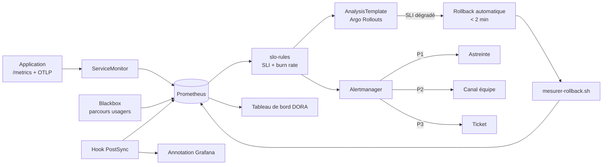

# 10 — Implémentation de la supervision

Ce document décrit **comment la supervision décrite en `docs/06` est réellement mise en œuvre** dans ce dépôt.
Il s'adresse à quelqu'un qui doit déployer, modifier ou exploiter la chaîne d'observabilité.

## 1. Inventaire des fichiers

| Fichier | Rôle |
|---|---|
| `gitops/base/servicemonitor.yaml` | Collecte des métriques de l'application, avec les étiquettes `version` et `env` |
| `gitops/base/slo-rules.yaml` | SLI, budget d'erreur et alertes de SLO, livrés **avec** l'application |
| `gitops/observabilite/valeurs-kube-prometheus-stack.yaml` | Socle : Prometheus, Alertmanager, Grafana, Thanos |
| `gitops/observabilite/prometheus-rules-plateforme.yaml` | Alertes sur la chaîne de livraison (rollout, Argo CD, Kyverno, capacité) |
| `gitops/observabilite/prometheus-rules-dora.yaml` | Calcul automatique des 4 indicateurs DORA |
| `gitops/observabilite/alertmanager-config.yaml` | Routage P1/P2/P3, inhibition, astreinte |
| `gitops/observabilite/blackbox-probes.yaml` | Supervision synthétique des parcours usagers |
| `gitops/observabilite/otel-collector.yaml` | Traces distribuées, échantillonnage intelligent |
| `gitops/observabilite/loki-alloy.yaml` | Logs structurés, corrélation `trace_id`, pseudonymisation |
| `gitops/observabilite/grafana-dashboards/*.json` | Trois tableaux de bord provisionnés |
| `gitops/observabilite/hook-annotation-deploiement.yaml` | Hook PostSync qui annote chaque MEP |
| `scripts/annoter-deploiement.sh` | Annotation Grafana + publication des métriques DORA |
| `scripts/mesurer-rollback.sh` | Mesure et publication de la durée réelle de retour arrière |
| `tests/prometheus/slo-rules-test.yaml` | Tests unitaires des alertes |
| `.github/workflows/observabilite.yaml` | Validation et tests en CI |

## 2. Trois choix à expliciter

### 2.1 La supervision est livrée avec l'application, pas à côté
`ServiceMonitor` et `PrometheusRule` sont dans `gitops/base/`, au même titre que le `Rollout`. Un service qui
n'expose pas ses SLI ne peut pas faire l'objet d'un déploiement canary analysé, puisque l'analyse n'aurait rien
à mesurer. La CI le vérifie (`couverture-supervision`) : c'est un contrôle bloquant, pas une bonne pratique.

### 2.2 L'alerting porte sur le budget d'erreur, pas sur des seuils fixes
Alerter dès qu'un taux d'erreur dépasse 1 % produit du bruit et des réveils inutiles. La méthode retenue
(multi-fenêtre, multi-burn-rate) combine une fenêtre courte, qui confirme que le problème est en cours, et une
fenêtre longue, qui confirme qu'il est significatif.

| Alerte | Fenêtres | Vitesse de consommation | Épuisement du budget | Action |
|---|---|---|---|---|
| `BudgetErreurConsommationTresRapide` | 5 min et 1 h | 14,4x | < 2 jours | Réveil de l'astreinte |
| `BudgetErreurConsommationRapide` | 30 min et 6 h | 6x | < 5 jours | Réveil de l'astreinte |
| `BudgetErreurConsommationLente` | 6 h et 3 j | 3x | < 10 jours | Ticket |

Le test `Pic isolé d'erreurs` dans `tests/prometheus/` vérifie précisément qu'une anomalie de trois minutes
**ne réveille personne**. C'est aussi important que de vérifier qu'une vraie panne déclenche bien l'alerte.

### 2.3 Les indicateurs DORA sont calculés, jamais saisis
Les quatre indicateurs promis à la direction sont dérivés de signaux déjà produits par la chaîne :
synchronisations Argo CD, événements Argo Rollouts, annotations de déploiement, durées d'incident.
Aucune saisie manuelle, donc aucun risque d'abandon au bout de deux mois faute de temps.

## 3. Boucle complète : de la métrique au rollback



Le point important : **les mêmes requêtes PromQL servent à alerter et à décider du rollback**. Il n'y a pas
deux définitions concurrentes de « le service va mal ». Si un seuil est ajusté, les deux usages évoluent ensemble.

## 4. Exigences d'instrumentation pour les équipes de développement

Ce que chaque application doit exposer pour entrer dans la chaîne :

```
GET /metrics   → format Prometheus, port 9090
  http_requests_total{service, status, route}                 (compteur)
  http_request_duration_seconds_bucket{service, route, le}    (histogramme)
  application_errors_total{service, severity}                 (compteur)

Traces         → OTLP vers otel.monitoring.svc:4317
  propagation W3C traceparent sur tous les appels sortants

Logs           → stdout, JSON une ligne par événement
  {"ts":"...","level":"error","message":"...","trace_id":"...","service":"...","version":"..."}
  Aucune donnée personnelle en clair (pseudonymisation à la collecte, RGPD)

GET /healthz            → vivacité
GET /readyz             → aptitude à recevoir du trafic
GET /healthz/dependencies → état des dépendances (base, services aval)
GET /version            → {"version":"1.4.2","digest":"sha256:..."} pour les tests de fumée
```

Ces points sont intégrés au template de service (`docs/09` §1) : un nouveau service les expose dès sa création,
sans travail supplémentaire.

## 5. Déploiement du socle

```bash
# 1. Déclarer l'application d'observabilité dans Argo CD
kubectl apply -f gitops/observabilite/application-observabilite.yaml

# 2. Vérifier que les règles sont chargées
kubectl get prometheusrules -A
promtool check rules <(yq '.spec' gitops/base/slo-rules.yaml)

# 3. Exécuter les tests d'alerte localement
promtool test rules tests/prometheus/slo-rules-test.yaml

# 4. Vérifier le routage sans attendre un incident
amtool alert add alertname=Test severity=P1 service=app-usagers env=prod \
  --alertmanager.url=http://alertmanager.monitoring.svc:9093
```

## 6. Calibrage avant activation du rollback automatique

Risque R5 du plan (`docs/08` §2) : des SLI mal calibrés produisent de faux rollbacks et ruinent la confiance
dans la chaîne. Procédure de mise en service, en semaine 7 et 8 :

1. Déployer les règles en **observation seule** : alertes actives, mais `AnalysisTemplate` non branché.
2. Collecter deux semaines de données en recette et en production pour établir la référence réelle de latence
   et de taux d'erreur.
3. Ajuster les seuils de l'`AnalysisTemplate` à partir de cette référence, et non de valeurs théoriques.
4. Activer l'analyse automatique d'abord sur le service pilote, puis généraliser.
5. Relire les seuils après le premier faux positif, sans attendre la revue mensuelle.

## 7. Entretien

| Rituel | Fréquence | Objet |
|---|---|---|
| Revue des alertes déclenchées | Mensuelle | Supprimer le bruit : une alerte ignorée trois fois est corrigée ou supprimée |
| Vérification des tableaux de bord | Mensuelle | Retirer les panneaux que personne ne regarde |
| Test de bout en bout de l'astreinte | Trimestrielle | Une alerte de test doit réellement joindre la personne d'astreinte |
| Revue des seuils de SLO | Trimestrielle | Avec le métier : un SLO doit refléter l'attente réelle des usagers |
